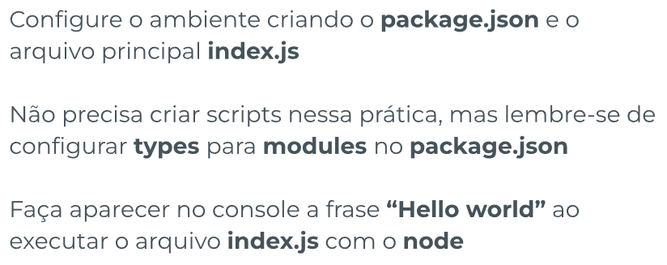
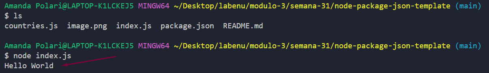
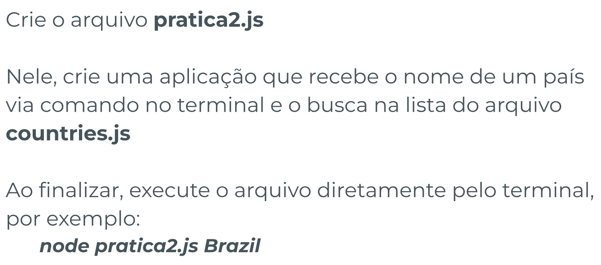
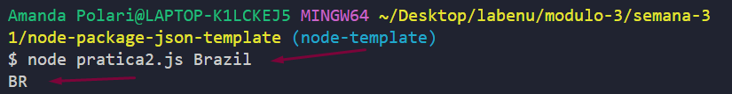
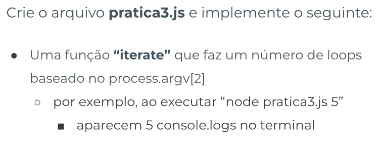
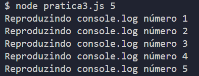

# Node.js e package.json - Template de Prática

## Índice

-   [1. Prática 1](#1-prática-1)
-   [2. Prática 2](#2-prática-2)
-   [3. Prática 3](#3-prática-3)

## 1. Prática 1

### Enunciado



### Resolução

-   Criando o package.json:

    ```
    npm init -y
    ```

-   Configurando `types` com o valor `module`:

    ```
    "type": "module",
    ```

    _Obs_: inserir essa linha logo abaixo de `"main"`

-   Configurando o `start`:

    ```
    "scripts": {
        "start": "node index.js",
        (...)
    },
    ```

-   Criei um arquivo index.js e escrevi no console a frase "Hello World", depois disso executei no terminal:

    ```
    node index.js
    ```

-   Resultado:
    

## 2. Prática 2

### Enunciado



### Resolução

Criei um arquivo chamado `pratica2.js` e dentro dele coloquei o seguinte código:

```
import { countries } from './countries.js';

const datas = countries;
// console.table(datas);

function getCountryCodeByName(name) {
    const country = datas.find(
        (country) => country.name.toLowerCase() === name.toLowerCase()
    );
    return country;
}

console.table(getCountryCodeByName(process.argv[2]));
```

Executei o comando:

```
node pratica2.js Brazil
```

E obtive esse resultado:


## 3. Prática 3

### Enunciado



### Resolução

Criei o arquivo `pratica3.js` com o seguinte código:

```
function iterate(num) {
    for (let i = 0; i < num; i++) {
        console.log(`Reproduzindo console.log número ${i + 1}`);
    }
}

iterate(process.argv[2])
```

Depois chamei no terminal:<br>

